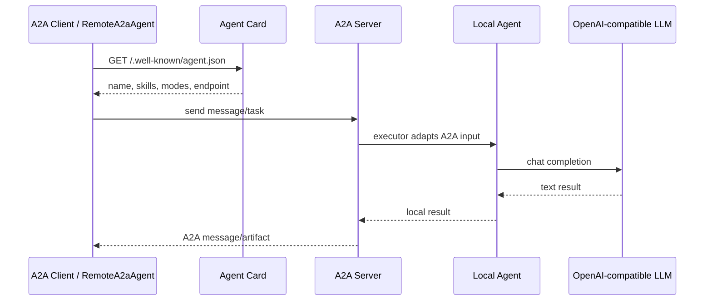

# A2A Demo

一个轻量的 Agent2Agent (A2A) 协议示例项目，展示如何把本地 LLM agent 封装成标准 A2A Server，并用 A2A Client 或 Google ADK 的 `RemoteA2aAgent` 调用多个远程 agent。

本项目使用 OpenAI-compatible Chat Completions API，所以可以接入任何兼容该接口的模型服务。仓库不绑定具体模型厂商。

## 项目结构

```text
.
├── config.example.json
├── requirements.txt
├── pyproject.toml
└── src/a2a_demo
    ├── agent_server.py      # 通用 A2A Server 封装
    ├── llm_client.py        # 通用 OpenAI-compatible LLM 调用
    ├── client.py            # A2A Client 示例
    ├── adk_demo.py          # ADK RemoteA2aAgent 多 agent 示例
    └── agents
        ├── math.py          # 数学 agent, port 9999
        ├── code.py          # 编程 agent, port 9998
        ├── translator.py    # 翻译 agent, port 9997
        └── summarizer.py    # 总结/规划 agent, port 9996
```

## A2A 通信是怎么发生的

A2A 的核心思想是：一个 agent 不直接调用另一个 agent 的内部函数，而是通过标准协议发现、请求和接收结果。



本项目里每个 agent 启动后都会暴露两个关键能力：

- `GET /.well-known/agent.json`：返回 Agent Card，告诉调用方自己是谁、会什么、怎么调用。
- A2A JSON-RPC endpoint：接收 A2A message/task，并返回标准 A2A 响应。

`src/a2a_demo/agent_server.py` 负责把普通 Python agent 包装成 A2A Server：

1. 用 `AgentDefinition` 描述 agent 的名称、技能、示例、端口和系统提示词。
2. 用 `LLMBackedAgentExecutor` 从 A2A request 中取出用户输入。
3. 调用本地 agent 逻辑。
4. 用 `new_agent_text_message()` 把结果封装回 A2A message。
5. 用 `A2AStarletteApplication` 暴露 HTTP 服务和 Agent Card。

## 从 0 开始运行

### 1. 创建环境

```powershell
conda create -y -n A2A python=3.11
conda activate A2A
pip install -e .
```

如果不想 editable install，也可以：

```powershell
pip install -r requirements.txt
$env:PYTHONPATH="src"
```

### 2. 配置模型

方式一：复制本地配置文件。

```powershell
copy config.example.json config.json
```

然后把 `config.json` 改成你的 OpenAI-compatible API 配置：

```json
{
  "base_url": "https://api.example.com",
  "api_key": "your-api-key",
  "model": "your-model-name"
}
```

方式二：使用环境变量。

```powershell
$env:LLM_BASE_URL="https://api.example.com"
$env:LLM_API_KEY="your-api-key"
$env:LLM_MODEL="your-model-name"
```

环境变量优先级高于 `config.json`。`config.json` 已被 `.gitignore` 忽略，不会提交到仓库。

### 3. 启动一个 agent

```powershell
python -m a2a_demo.agents.math
```

另开一个终端调用它：

```powershell
conda activate A2A
python -m a2a_demo.client --port 9999 --prompt "How many prime numbers are less than 1000?"
```

### 4. 启动全部 agent

分别打开 4 个终端：

```powershell
python -m a2a_demo.agents.math
python -m a2a_demo.agents.code
python -m a2a_demo.agents.translator
python -m a2a_demo.agents.summarizer
```

对应端口：

| Agent | Port | Skill |
| --- | ---: | --- |
| MathAgent | 9999 | 数学计算和推理 |
| CodeAgent | 9998 | 代码生成、解释、审查 |
| TranslatorAgent | 9997 | 翻译 |
| SummarizerPlannerAgent | 9996 | 总结和计划 |

### 5. 用 ADK 编排多个远程 agent

确保 4 个 agent 都已启动，然后运行：

```powershell
python -m a2a_demo.adk_demo
```

`adk_demo.py` 会用 `RemoteA2aAgent` 读取每个远程 agent 的 `/.well-known/agent.json`，再通过 ADK 的 `SequentialAgent` 串行调用它们。

## 如何把已有 agent 封装成 A2A Server

如果你已经有一个 LangGraph、CrewAI、Semantic Kernel、FastAPI 服务或自研 agent，不需要重写核心逻辑。推荐做法是增加一层 adapter：

```text
Existing Agent
    ↑
A2A Executor Adapter
    ↑
A2A Server + Agent Card
    ↑
Remote A2A Client / RemoteA2aAgent
```

落地步骤：

1. 保留已有 agent 的内部实现，例如 `my_agent.run(user_input)`。
2. 定义 Agent Card：名称、描述、输入输出模式、技能和示例。
3. 实现 `AgentExecutor.execute()`：从 `context.get_user_input()` 获取输入。
4. 在 executor 中调用已有 agent。
5. 用 `new_agent_text_message()` 或 artifact 把结果转成 A2A 响应。
6. 用 `A2AStarletteApplication` 暴露 HTTP 服务。

在本项目中，`AgentDefinition` 和 `run_agent()` 已经把这些样板代码封装好了。新增一个 agent 通常只需要创建一个模块，填写定义并调用 `run_agent()`。

## 版本说明

当前依赖锁定为：

```text
a2a-sdk[http-server]==0.3.26
google-adk==2.1.0
```

原因是 `google-adk==2.1.0` 的 `RemoteA2aAgent` 仍依赖 `a2a-sdk` 0.3.x 的部分导出结构；直接安装最新 `a2a-sdk` 1.x 可能导致导入错误。这个版本组合已经在本 demo 中验证可用。

## 安全提示

- 不要提交真实 API key。
- 如果密钥曾经出现在公开提交、日志或聊天记录中，请立刻轮换。
- 生产环境中请增加认证、限流、日志脱敏、超时控制和权限隔离。
