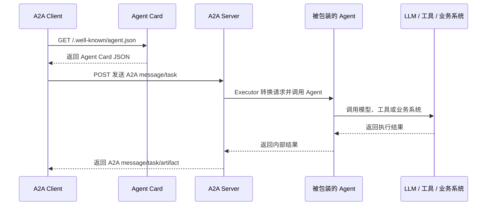

# A2A 协议科普：Agent 之间如何发现、调用和协作

## 1. A2A 解决什么问题

A2A 是 Agent2Agent 的缩写，可以理解为一种“让不同 Agent 通过标准方式互相通信”的协议。

在没有 A2A 之前，如果一个 Agent 想调用另一个 Agent，通常会遇到几个问题：

- 对方 Agent 是什么框架写的？LangGraph、ADK、CrewAI，还是自研？
- 对方 Agent 在哪里？本地进程、远程服务器、云服务，还是另一个团队维护的系统？
- 对方 Agent 有哪些能力？能写代码、做数学、查资料，还是处理文件？
- 调用方式是什么？HTTP API、函数调用、消息队列，还是 SDK？
- 返回结果是什么格式？文本、文件、结构化 JSON，还是异步任务？

A2A 想做的事情，就是把这些差异收敛成一套标准通信方式。

一句话概括：

```text
A2A 让一个 Agent 可以像调用标准服务一样，发现并调用另一个 Agent。
```

## 2. 普通 Agent 调用和 A2A 调用有什么区别

普通调用通常是进程内函数调用：

```python
result = math_agent.run("1000 以内有多少个质数？")
```

这种方式的前提是：

- 调用方和被调用 Agent 在同一个代码库或同一个进程里。
- 调用方能直接拿到 `math_agent` 这个 Python 对象。
- 两边使用同一种语言和运行环境。

A2A 调用不是直接调用函数，而是把 Agent 暴露成一个网络服务：

```text
调用方 Agent
    ↓ HTTP / JSON-RPC
远程 A2A Server
    ↓
被调用 Agent
```

这意味着：

- 被调用 Agent 可以运行在另一个进程。
- 被调用 Agent 可以运行在另一台机器。
- 被调用 Agent 可以由另一个团队维护。
- 调用方不需要知道对方内部怎么实现，只需要知道它的 Agent Card 和调用地址。

## 3. A2A 的核心角色

### 3.1 A2A Client

A2A Client 是发起调用的一方。

它可能是：

- 一个普通应用服务。
- 一个用户界面后端。
- 一个 Agent。
- 一个负责调度其他 Agent 的 Router Agent。

它的职责是：

1. 获取远程 Agent 的 Agent Card。
2. 判断远程 Agent 是否适合完成任务。
3. 把用户请求封装成 A2A 消息或任务。
4. 发送请求。
5. 接收结果、状态更新或产物。

### 3.2 A2A Server

A2A Server 是被调用的一方。

它通常包装了一个已有 Agent：

```text
已有 Agent 逻辑
    ↑
A2A Executor / Adapter
    ↑
A2A Server
```

它的职责是：

1. 对外暴露 Agent Card。
2. 接收 A2A Client 发来的任务。
3. 把 A2A 请求转换成内部 Agent 能理解的输入。
4. 调用内部 Agent。
5. 把内部结果转换成 A2A 响应。

### 3.3 Agent Card

Agent Card 是 Agent 的公开名片。

它通常是一个 JSON 文档，用来告诉外部调用方：

- 我是谁。
- 我能做什么。
- 我的服务地址在哪里。
- 我支持哪些输入输出模式。
- 我有哪些技能。
- 调用我是否需要认证。
- 我是否支持流式输出、异步任务等能力。

可以把 Agent Card 类比成 REST API 里的 OpenAPI 文档，只不过它描述的是一个 Agent，而不是一组普通接口。

一个简化后的 Agent Card 可能长这样：

```json
{
  "name": "MathAgent",
  "description": "解决数学计算和推理任务。",
  "url": "https://example.com/a2a/math",
  "version": "1.0.0",
  "defaultInputModes": ["text"],
  "defaultOutputModes": ["text"],
  "capabilities": {
    "streaming": false
  },
  "skills": [
    {
      "id": "math-calc",
      "name": "数学计算",
      "description": "解决算术、代数和分步骤数学推理任务。",
      "tags": ["数学", "推理", "计算"],
      "examples": ["1000 以内有多少个质数？", "根号 5 等于多少？"]
    }
  ]
}
```

## 4. A2A 的基本通信流程

最典型的 A2A 调用分为两步：

```text
第一步：发现 Agent
GET /.well-known/agent.json

第二步：调用 Agent
POST AgentCard.url
```

整体时序如下：



### 4.1 第一步：GET 获取 Agent Card

调用方先访问远程 Agent 的发现地址：

```text
GET https://example.com/.well-known/agent.json
```

有些 SDK 或版本也会使用类似下面的地址：

```text
GET https://example.com/.well-known/agent-card.json
```

实际项目中应该以你使用的 SDK 和协议版本为准。核心思想不变：调用方先拿到 Agent Card，再根据 Agent Card 里的信息调用服务。

### 4.2 第二步：POST 发送任务

Agent Card 里会有一个 `url` 字段：

```json
{
  "url": "https://example.com/a2a/math"
}
```

调用方随后向这个 `url` 发送 POST 请求。请求体通常是 A2A 协议定义的 JSON-RPC 消息或任务。

也就是说：

```text
GET /.well-known/agent.json 是发现。
POST AgentCard.url 是调用。
```

## 5. Agent Card 是怎么生成的

Agent Card 不一定要是一个静态 JSON 文件。实际工程里更常见的是：启动服务时由代码动态生成。

典型方式是先定义一份内部配置：

```python
agent_definition = {
    "name": "MathAgent",
    "description": "解决数学计算和推理任务。",
    "skill_id": "math-calc",
    "skill_name": "数学计算",
    "skill_description": "解决算术、代数和分步骤数学推理任务。",
    "tags": ["数学", "推理", "计算"],
    "examples": ["1000 以内有多少个质数？", "根号 5 等于多少？"],
    "endpoint": "https://example.com/a2a/math"
}
```

然后由服务启动代码把它拼成 Agent Card：

```python
agent_card = {
    "name": agent_definition["name"],
    "description": agent_definition["description"],
    "url": agent_definition["endpoint"],
    "version": "1.0.0",
    "defaultInputModes": ["text"],
    "defaultOutputModes": ["text"],
    "capabilities": {
        "streaming": False
    },
    "skills": [
        {
            "id": agent_definition["skill_id"],
            "name": agent_definition["skill_name"],
            "description": agent_definition["skill_description"],
            "tags": agent_definition["tags"],
            "examples": agent_definition["examples"]
        }
    ]
}
```

最后由 Web 服务把这个 `agent_card` 暴露到 well-known 地址：

```text
GET /.well-known/agent.json
```

所以需要区分两个概念：

```text
内部定义：开发者维护的配置，描述这个 Agent 是什么。
Agent Card：对外公开的协议对象，供其他 Agent 发现和调用。
```

外部调用方一般拿不到内部定义，只能拿到 Agent Card。

## 6. 端口的作用是什么

A2A 不强制要求“每个 Agent 一个端口”。A2A 需要的是：每个可被远程调用的 Agent 有一个可访问的 URL。

在本地 demo 中，最直观的做法是每个 Agent 启动一个服务，占用一个端口：

```text
http://localhost:9999 -> MathAgent
http://localhost:9998 -> CodeAgent
http://localhost:9997 -> TranslatorAgent
```

端口的作用是告诉操作系统：这个 HTTP 请求应该交给哪个进程处理。

但生产环境中也可以用其他方式：

```text
https://api.example.com/agents/math
https://api.example.com/agents/code
https://math-agent.example.com/
https://code-agent.example.com/
```

因此更准确的说法是：

```text
A2A 需要可访问 URL。
不同端口只是本地开发时区分多个服务的一种方式。
```

## 7. 谁决定调用哪个 Agent

A2A 本身提供“发现和调用”的协议能力，但不强制规定“如何选择 Agent”。

选择哪个 Agent，通常由上层编排逻辑决定。

### 7.1 手动选择

用户或程序直接指定目标 Agent：

```text
调用 MathAgent 的 URL。
调用 CodeAgent 的 URL。
调用 TranslatorAgent 的 URL。
```

这种方式最简单，也最容易调试。

### 7.2 固定顺序调用

一个编排器按固定顺序调用多个 Agent：

```text
用户请求
  -> MathAgent
  -> CodeAgent
  -> TranslatorAgent
  -> SummarizerAgent
```

这种方式适合流水线任务，比如“先分析，再执行，再总结”。

### 7.3 Router Agent 动态路由

也可以增加一个 Router Agent，由它根据问题内容选择目标 Agent：

```text
用户请求
  -> RouterAgent
      -> 判断问题类型
      -> 选择 MathAgent / CodeAgent / TranslatorAgent
      -> 调用被选中的 Agent
      -> 返回结果
```

Router Agent 可以用规则实现：

```text
包含“翻译”或 translate -> TranslatorAgent
包含“代码”或 Python -> CodeAgent
包含“计算”或“根号” -> MathAgent
否则 -> SummarizerAgent
```

也可以用 LLM 实现：

```text
先让模型判断用户意图和目标能力，再调用对应 Agent。
```

所以要特别注意：

```text
Agent Card 描述 Agent 能力。
Router 或编排器决定调用哪个 Agent。
A2A 协议负责把调用标准化。
```

## 8. 如何把已有 Agent 封装成 A2A Server

如果你已经有一个 Agent：

```python
class MyAgent:
    def run(self, user_input: str) -> str:
        return "result"
```

要把它接入 A2A，通常不需要重写 Agent，只需要加一层 Adapter：

```text
已有 Agent
    ↑
A2A Executor / Adapter
    ↑
A2A Server
    ↑
A2A Client / 其他 Agent
```

实现步骤：

1. 定义 Agent Card，说明这个 Agent 是谁、会什么、怎么调用。
2. 启动一个 HTTP 服务，暴露 `/.well-known/agent.json`。
3. 实现 A2A 的 POST 调用入口。
4. 在调用入口中解析 A2A message/task。
5. 把用户输入传给已有 Agent 的 `run()` 方法。
6. 把 Agent 返回结果封装成 A2A response。
7. 返回给调用方。

伪代码如下：

```python
def handle_a2a_request(request):
    user_input = parse_a2a_message(request)
    result = my_agent.run(user_input)
    return build_a2a_response(result)
```

真实项目中一般会使用 A2A SDK 来处理协议细节，而不是完全手写 JSON-RPC。

## 9. 同进程 Agent 和远程 Agent 如何选择

不是所有 Agent 都必须暴露成 A2A 服务。

如果多个 Agent 都在同一个代码库、同一个进程里，而且不会被外部系统直接调用，那么普通函数调用就足够：

```text
RouterAgent
  -> 进程内调用 MathAgent
  -> 进程内调用 CodeAgent
```

如果某个 Agent 需要被其他进程、其他服务、其他团队或外部系统调用，就适合封装成 A2A Server：

```text
RouterAgent
  -> A2A 调用 MathAgent 服务
  -> A2A 调用 CodeAgent 服务
```

可以这样判断：

| 场景 | 推荐方式 |
| --- | --- |
| 同一个代码库内部复用 | 直接函数调用 |
| 同一个后端服务内部编排 | 直接函数调用或内部接口 |
| 不同进程之间调用 | A2A |
| 不同机器之间调用 | A2A |
| 不同团队或供应商之间调用 | A2A |
| 希望 Agent 能被自动发现 | A2A + Agent Card |

## 10. 常见误区

### 误区一：A2A 必须每个 Agent 一个端口

不是。A2A 需要 URL，不强制要求独立端口。独立端口只是本地 demo 最容易理解。

### 误区二：GET Agent Card 就是在调用 Agent

不是。GET Agent Card 只是发现 Agent。真正执行任务通常是 POST 到 Agent Card 里的 `url`。

### 误区三：Agent Card 会自动帮你选择 Agent

不是。Agent Card 只是描述能力。选择哪个 Agent 需要 Router、编排器或调用方自己决定。

### 误区四：接入 A2A 必须重写已有 Agent

不是。通常只需要在已有 Agent 外面加一层 A2A Server Adapter。

### 误区五：A2A 只能传文本

不是。A2A 的数据模型可以支持文本、文件、结构化数据、任务状态和产物等能力。具体能力取决于协议版本、SDK 和服务实现。

## 11. 一句话总结

```text
A2A = Agent Card 发现能力 + 标准消息协议调用 Agent + 任务/结果标准化返回。
```

更直观地说：

```text
Agent Card 负责告诉别人“我是谁、我会什么、怎么调用我”。
A2A Client 负责根据这张名片发起标准请求。
A2A Server 负责把标准请求转成内部 Agent 调用。
Router 或编排器负责决定该调用谁。
```

## 参考资料

- Agent2Agent Protocol 文档：https://agent2agent.ren/docs/introduction
- A2A 规范说明：https://a2aproject.github.io/A2A/latest/specification/
- Microsoft A2A Agent 文档：https://learn.microsoft.com/en-us/agent-framework/agents/providers/agent-to-agent
